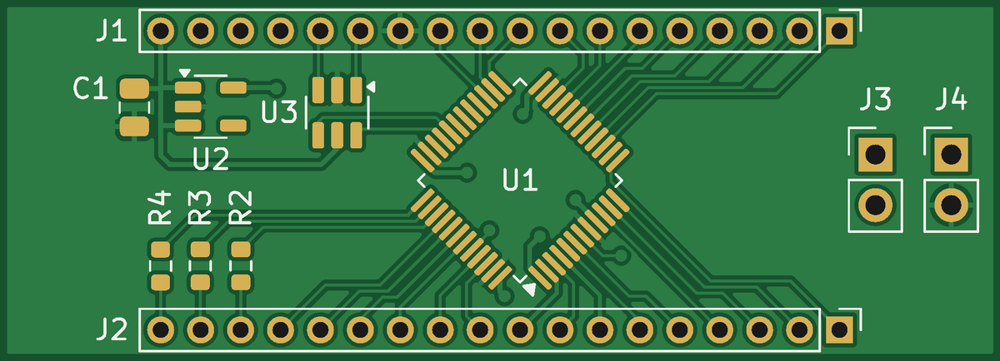
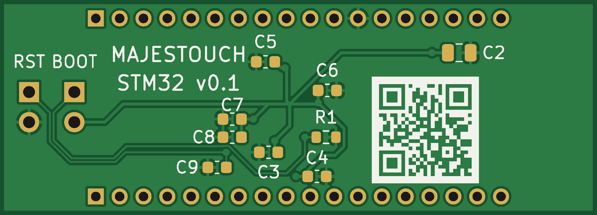
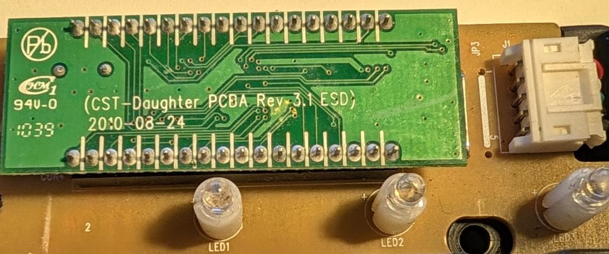
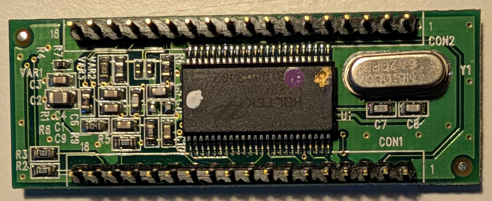

# majestouch-stm32

A drop-in replacement controller for the full-size Filco Majestouch, built
around an STM32F072. It replaces the stock daughterboard, plugs into the same
36-pin header on the main PCB and runs [QMK](https://qmk.fm); the QMK keyboard
definition is included.

> [!WARNING]
> **Untested.** The first boards are on order and have not been built or
> verified on a keyboard yet. Order and build at your own risk until this
> notice is gone.

<p align="center">
  
  
</p>
<p align="center"><sub>Component side (faces the main PCB) and outward side, rendered from the KiCad board.</sub></p>

## Background

I was looking for a replacement for my 2010 Majestouch, but gave it a full
service and fresh keycaps instead. Reading up on it, I came across the
[Kitten Paw](https://deskthority.net/wiki/Costar_replacement_controllers)
(ATmega32U2 + 74HC154), the replacement controller for Costar boards such as
the Filco, about a decade after everyone else did, and
[Majestouch-2-TKL-Replacement-Controller](https://github.com/calliah333/Majestouch-2-TKL-Replacement-Controller),
which does the same for the Majestouch 2 TKL with an STM32.

PS/2 left my desk a long time ago, and over USB the stock controller only does
6KRO. I wanted my NKRO back, so I tried making one myself. It's my first open
source hardware project, and the design turned out to be quite
straightforward. It takes the STM32 approach to the full-size board and keeps
it simple:

- **STM32F072CBT6**: crystal-less USB (HSI48 + clock recovery), internal
  flash, ROM bootloader with USB DFU, and 5 V-tolerant pins for the lock LEDs.
  All 26 matrix lines are scanned directly, with no decoder chip.
- **NKRO over USB** (on by default in the QMK definition), where the stock
  controller only did 6KRO over USB.
- **16 components**, LQFP-48 and 0603/0805 passives: hand-solderable.
- USB ESD protection (USBLC6-2SC6) and a 3.3 V LDO (AP2112K-3.3).
- 50 × 18 mm, 2 layers, standard process at any PCB fab.

## Compatibility

Built for and measured on a full-size ANSI Majestouch with main PCB
`CST 104/5/6 Main PCBA Rev 1.2` and stock daughterboard
`CST-DAUGHTER PCBA Rev 3.1 ESD`.

The full-size Filcos below share the same 36-pin header and matrix according
to deskthority, and the Kitten Paw is listed for the same main PCBs, so they
are expected to work, but are untested with this board:

| Keyboard | Main PCB |
|---|---|
| Majestouch (FKBN104/105) | CST-FKB/N-104/5/6 Main PCBA Rev 1.0 / 1.2 (2010) |
| Majestouch Linear R | CST-F104/5/6/8 Main PCB Rev 2.1 (2010) |
| Majestouch 2 | CST-F104/5/6/8 Main PCB Rev 3.0 (2012) |

Full NKRO needs a diode per key. Filco marks those boards with an N in the
model code (FKB**N**…, "N-key rollover using separate diodes"); the cheaper
2KRO models without it work too, but ghost on some key combinations.

Compare your stock controller with the pinout below before fitting. The QMK
definition currently has the ANSI layout only; ISO boards work electrically
but need an ISO layout for the two extra keys. The Majestouch TKL uses a
different header and does not fit.

## Repository

```
kicad/                       KiCad 7 project (schematic, board, design rules)
firmware/majestouch_stm32/   QMK keyboard definition
tools/check.py               validation: schematic, firmware pins and board
tools/fab.py                 fabrication package (Gerbers, drill, BOM)
docs/                        board renders, photos of the stock controller
```

`tools/check.py` checks the schematic against the STM32 datasheet pinout and
the Filco header map, checks that every pin in the QMK definition lands on the
right net, and runs KiCad's design rule check on the board. It needs KiCad 7
(`kicad-cli` and the `pcbnew` Python module).

## Header pinout

From the Filco Majestouch table on deskthority's
[controller matrix traces](https://deskthority.net/wiki/Controller_matrix_traces)
page, cross-checked pin for pin against the
[Kitten Paw schematic](https://deskthority.net/wiki/File:Kitten_Paw_20160418_Schematic.svg).
The component side
faces the main PCB; seen from that side, pin 1 is top-right, pins 1–18 run
right to left, and pin 19 sits directly below pin 1.

| Pin | Signal | STM32 | | Pin | Signal | STM32 |
|---|---|---|---|---|---|---|
| 1 | COL0 | PA5 | | 19 | ROW_K | PA3 |
| 2 | ROW_A | PA6 | | 20 | COL1 | PA2 |
| 3 | ROW_B | PA7 | | 21 | ROW_L | PA1 |
| 4 | ROW_C | PB0 | | 22 | COL2 | PA0 |
| 5 | ROW_D | PB1 | | 23 | COL3 | PF1 |
| 6 | ROW_E | PB2 | | 24 | ROW_M | PF0 |
| 7 | ROW_F | PB10 | | 25 | ROW_N | PC15 |
| 8 | ROW_G | PB11 | | 26 | ROW_O | PC14 |
| 9 | ROW_H | PB12 | | 27 | ROW_P | PC13 |
| 10 | ROW_I | PB13 | | 28 | ROW_Q | PB9 |
| 11 | ROW_J | PB14 | | 29 | COL4 | PB8 |
| 12 | GND | | | 30 | ROW_R | PB7 |
| 13 | USB D+ | ESD → PA12 | | 31 | COL5 | PB6 |
| 14 | USB D− | ESD → PA11 | | 32 | COL6 | PB5 |
| 15 | n/c | | | 33 | COL7 | PB4 |
| 16 | n/c | | | 34 | LED Num Lock | PB3 |
| 17 | n/c | | | 35 | LED Caps Lock | PA15 |
| 18 | VBUS | LDO in | | 36 | LED Scroll Lock | PA14 |

Pins 15 and 16 are tied to GND on the main PCB; this board leaves 15–17
unconnected.

<p align="center">
  
  
</p>
<p align="center"><sub>The stock controller this board replaces: installed, solder side up, next to the lock LEDs and the USB cable connector; and removed, component side, oriented like the render above (CON2 = pins 1–18 on top, pin 1 at the right).</sub></p>

## Circuit

- **USB**: D+/D− pass through the USBLC6-2SC6 flow-through (in on pins 1/3,
  out on 6/4), so no route bypasses the clamp. The STM32's internal pull-up
  handles D+.
- **Power**: VBUS → AP2112K-3.3. Each MCU supply pin has its own decoupling
  cap: 1 µF + 10 nF on VDDA, 100 nF on VDD, VDDIO2 and VBAT.
- **Matrix**: 18 rows driven, 8 columns read (QMK `COL2ROW`). The main PCB
  has no pull-ups to 5 V on the matrix lines, so the 3.6 V-only pins
  (PA0–PA7, PB0/PB1) are safe.
- **Lock LEDs**: the LED anodes sit on +5 V on the main PCB. The MCU sinks
  each LED through a 10 k resistor from a 5 V-tolerant pin in open-drain mode,
  like the stock controller (~0.3 mA).
- **BOOT / RESET**: 2.54 mm jumper holes. BOOT0 has a 10 k pull-down, NRST
  100 nF to GND.

**Board:** 50 × 18 mm, 2 layers, 1.2 mm FR-4. 0.15 mm tracks and clearance
(0.25 mm for power), 0.3 mm vias, GND pour on both sides. The MCU sits at 45°
so each side fans out to one header row. ICs, C1 and the LED resistors are on
the component side (facing the main PCB), the other passives on the outward
side. The outward side carries the reference designators, BOOT/RST labels and
a QR code linking to this repository.

## Making one

> [!CAUTION]
> Seriously: don't build one yet. Wait until the first boards have been
> assembled and tested, and this banner is gone.

### Board

```sh
cd tools
python3 check.py   # validate first
python3 fab.py
```

This builds `kicad/fab/majestouch_stm32-gerbers-<rev>.zip` (Gerbers and drill
files, accepted by any PCB fab) plus `bom.csv` with the parts used and what an
equivalent needs. Tagged releases have both attached, built and validated by GitHub
Actions (`.github/workflows/release.yml`).

Order settings: 2 layers, FR-4, 1.2 mm (the stock board's thickness; 1.6 mm
fits too), HASL lead-free or ENIG. The design stays within standard rules
(0.15 mm track/space, 0.3 mm drills). If your fab prints an order number on
the board (JLCPCB does by default), choose the option without it, so it
doesn't land on the QR code. `cpl.csv` (pick-and-place) is only needed if the
fab assembles the board.

### Parts

| Ref | Part | Package |
|---|---|---|
| U1 | STM32F072CBT6 | LQFP-48 |
| U2 | AP2112K-3.3 | SOT-23-5 |
| U3 | USBLC6-2SC6 | SOT-23-6 |
| C1 | 4.7 µF | 0805 |
| C2 | 10 µF | 0805 |
| C3–C6, C9 | 100 nF | 0603 |
| C7 | 1 µF | 0603 |
| C8 | 10 nF | 0603 |
| R1–R4 | 10 k | 0603 |
| J1, J2 | 2.0 mm pin header, 1 × 40 strip snapped to 2 × 18 | |
| J3, J4 | 2.54 mm 1 × 2 header (optional) | |

Any equivalent part works: X5R/X7R capacitors at 10 V or more, 1 % or 5 %
resistors.

### Assembly

U1, U2, U3, C1 and R2–R4 go on the component side, the other passives on the
back; every part is labelled on the silkscreen. Mind the pin-1 triangles on
U1, U2 and U3: U2 and U3 short VBUS to GND when rotated. Solder the pin
headers last, with the plastic on the component side, then fit the board in
place of the stock controller.

### Firmware

Copy `firmware/majestouch_stm32` into `qmk_firmware/keyboards/`, then:

```sh
qmk compile -kb majestouch_stm32 -km default
```

First flash: bridge the BOOT jumper while plugging in USB (or bridge BOOT and
tap RESET) to start the STM32's DFU bootloader, then
`qmk flash -kb majestouch_stm32 -km default`. After that, hold Esc while
plugging in to get back to the bootloader.

The default keymap is a standard full-size ANSI layout. The Caps/Num/Scroll
LEDs follow the host's lock state.

## Verified on the keyboard

Measured on the target keyboard before ordering:

- outline and header position match the stock board (1:1 print);
- no connection from VBUS to any matrix pin on the main PCB;
- lock LED anodes on +5 V, active low;
- enough height between the boards; stock board 1.2 mm thick.

## References

- [Controller matrix traces](https://deskthority.net/wiki/Controller_matrix_traces)
  (deskthority wiki): the Filco Majestouch header pinout and matrix.
- [Kitten Paw schematic](https://deskthority.net/wiki/File:Kitten_Paw_20160418_Schematic.svg)
  by Bpiphany (public domain): the reference replacement controller for the
  full-size Filco, used to cross-check the header.
- [Costar replacement controllers](https://deskthority.net/wiki/Costar_replacement_controllers)
  (deskthority wiki): the Kitten Paw and its relatives.
- [Majestouch-2-TKL-Replacement-Controller](https://github.com/calliah333/Majestouch-2-TKL-Replacement-Controller):
  an STM32 replacement controller for the Majestouch 2 TKL.
- [STM32F072CB datasheet](https://www.st.com/resource/en/datasheet/stm32f072cb.pdf) (DS9826),
  [USBLC6-2 datasheet](https://www.st.com/resource/en/datasheet/usblc6-2.pdf),
  [AP2112 datasheet](https://www.diodes.com/assets/Datasheets/AP2112.pdf).

## License

MIT, see [LICENSE](LICENSE). This covers the hardware, the tools and the QMK
keyboard definition. Firmware built with QMK includes QMK itself, which is
GPL-2.0-or-later, so compiled binaries fall under the GPL.
